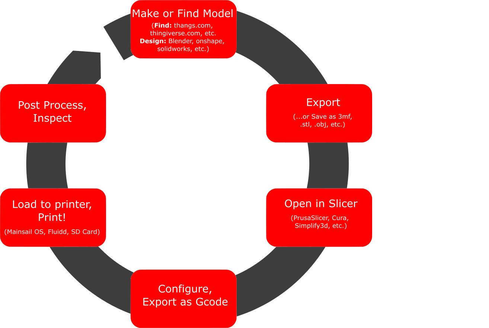

# 3d Printing

So you want to learn about 3D printing? We have quite a few printers at RMM in many stages of repair. A list of many of them can be found at the bottom of this page. There are usually a few that are able to print attractive plastic objects at any given moment.

  

## Process Overview

3D printers use G-code, a sort of standardized language for CNC machines of all sorts. You start with a 3d design, export a mesh (aka a .3MF or .STL file), and run it through a program called a slicer. The slicer needs to know about the design, the printer, and the material you're going to use in order to do its job. The slicer cuts the mesh into thin slices called layers, figures out how to coordinate all the moving parts of the printer to produce the object you desire, and stores the printer instructions in a gcode file. Getting the best results from a 3D printer depends on knowing about the process in general, the specific printer you're going to use, and how to apply different slicer options to the design you're going to print. Expect to have some failures along the way- it takes some experience to get good at it, but you'll figure it all out with a little practice, and there are experts at the Makerspace who can help you.

## Find a Model

## Make a Model

## Slicer

## Upload and Print

## Machines at the space

### Functioning Machines:
* Voron V2.4 350mm with Revo Nozzle (http://voron-350.local/)
* Ender 3 (SD card)

### Non-Functioning Machines:
* Voron V0 (http://3dp-v0-450.local/)
* 2x Ender 3's
* Custom delta

