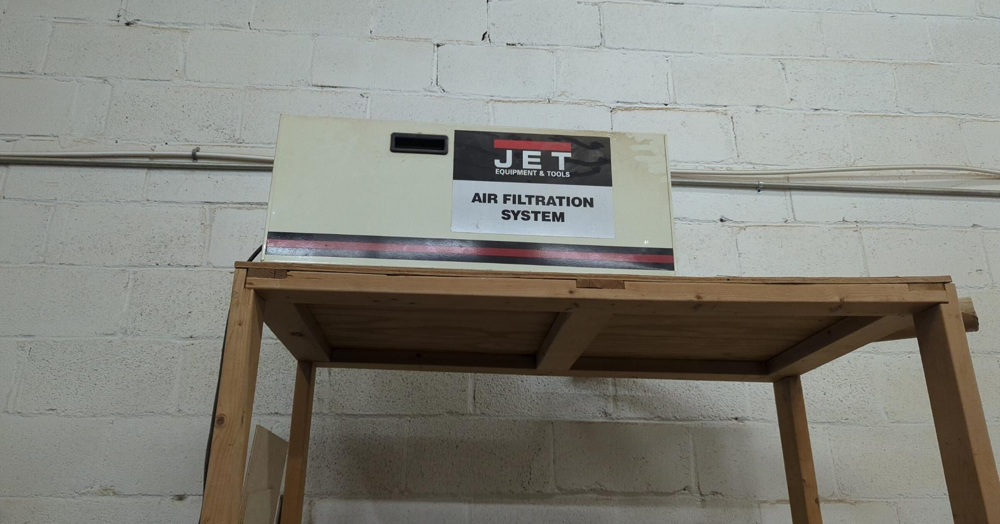
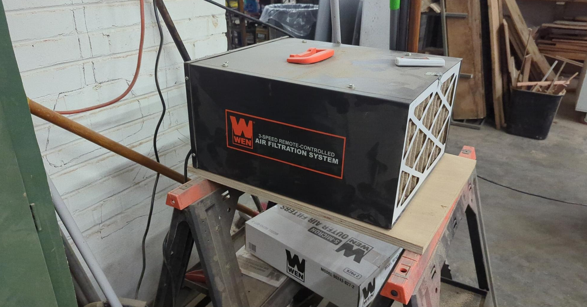

# Wood Shop
The 1400 ft2 heart of our Makerspace features a variety of woodworking tools, including saws, planers, lathes, sanders, routers, hand tools, and much more. This shop is extremely versatile, where makers of all varieties will find the right tool for the job. The woodshop also has limited supplies of lumber available for use by members.

## Contents
1. [Tools](#tools)
2. [Safety](#safety-gear)

## Tools
* [Bandsaw](Kity-613-Bandsaw)
* [Table Saw](Saw-Stop-Table-Saw)
* [Miter Saw]()
* [Router Table]()
* [Planer]()
* [Jointer]()
* [Clamp Cart]()
* [Wood Lathe]()
* [Drill Press]()
* [Belt/Disc Sander]()
* [Oscilating Spindle Sander]()
* [Bench Grinder]()
* [Hand tools]()
* [Dust Collection/Air Filtration]()
* [Consumables]()
## Safety
### Safety Gear
The space comes with a closet of safety gear. This includes eye and ear protection, masks, gloves, and first aid
* Do not wear loose-fitting long-sleeved clothes that could catch on equipment. 
* Wear closed-toed shoes within shop
* Do not wear gloves when using equipment- these can also be caught on blades.

### First Aid
First aid supplies are in the top left of the green woodworking cabinet
Another set of first aid supplies are located in the classroom

### DUST COLLECTION
* Ensure when you begin use of the shop, both air filters are turned on. Sawdust is a carcinogenic, especially fine particles

* There is a central dust collector with a button fob to activate it. The following equipment requires it to be turned on and have the collection pipe connected:

    * Tablesaw
    * Router
    * Bandsaw

* All other equipment except the Miter saw has exhaust ports that can be attached to shop vacs. 

